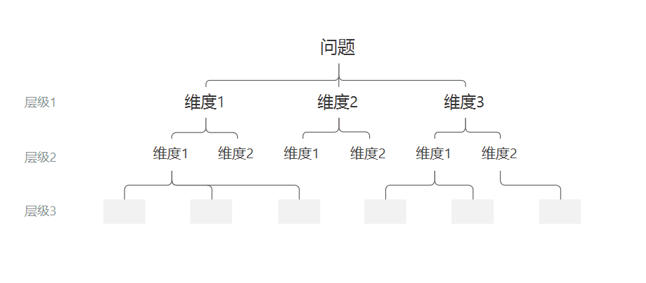
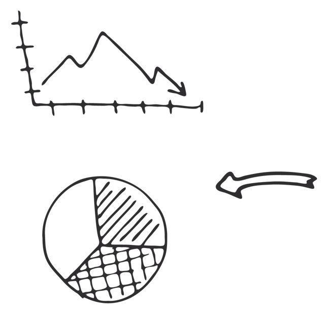

# 知识储备有限，如何做好问题分析

以前考试的时候，很害怕开放性的分析题，什么分析人物心理、分析事件的历史意义、现象产生的利弊影响…

总感觉“分析”这个词，说着轻巧，做起来却无法可依，无从下手，于是呼硬着头皮，想啥写啥，也不管写出来的东西算不算是分析，反正，考卷上睁眼说瞎话是我的拿手好戏。

带着枷锁跳舞向来是我国教育的常态，许多问题的解答都有既定的约束和答案，照着老师教的套路解答，就能得到恒定的结果。

而抛开限制，怎么去解答一个开放的、没有恒定答案的问题，好像老师们从来都没教过，他们更多时候的只是把自己想到的解答分享给我们。

工作以后才发现，现实中的许多问题都没有恒定答案，分析数据、剖析用户心理、寻找业务问题、思考产品优化点…

对大多数人来说，特别是职场新人，分析往往变成了一个拍脑袋的过程，大家拼的就是知识储备，谁知识储备多，思考结果就更胜一筹。

**“分析”光靠知识储备肯定不行，也不现实，问题不会等我们攒够知识才出现，老板不会等你学够了才问你要结果**。

好在，分析其实也有一定的特点和章法。

**如字面意思理解，“分析”就是“分”和“析”，分开和解释。**

## 01

换个说法，分析是从维度和深度对问题进行探索的过程。即从不同维度将问题分解细化，然后再对每一个分点深入剖析和再分解，以此反复，层层深入。

这个过程可以想象成由顶点开始构造的金字塔，由最初的一点，越往下深入，每一层的面积就越来越大，涵盖的内容就越细且越广。以此做到全面而不重复。

开个脑洞，用这个技巧分析一下，“老妈去菜市场买菜”这个场景。

首先，从两个维度分解问题：品类维度和时间维度。

接着，对分问题进行解释和再分解：

1. 品类维度，买什么菜？这个问题可以再分解：

人物维度，买什么菜取决于买菜给谁吃。今天在外地工作的儿子难得回家，那买点儿子爱吃的家乡特产；今天家里来了客人，那买点海鲜，做一顿丰盛的；今天就老两口在家，血糖都有点高，买点蔬菜吃清淡点…

时节维度，这个季节什么食品最当季？端午前后的竹笋很嫩；渔港解禁海鲜一定鲜美；中秋的水果特别的甜……

2. 时间维度，什么时间去买菜？这个维度又可分解成地点维度、品类维度…

地点维度：去超市买？超市开门晚，十点后再去；去菜市场买，菜市场的摊档营业早，早去能买到最新鲜的，晚去好东西就没了，所以7点去吧…

品类维度：想吃海鲜？渔民都是凌晨捕完鱼就运到市场，早点去买最新鲜；想吃烧鸡？那家档口早上才开始烧鸡，中午去买刚刚好；想吃牛肉，屠宰场下午才杀牛，下午4、5点再去吧…

简简单单“老妈去买菜”的场景，通过每层两三个维度，深入分解三层之后，可以分析出一个完善的购物规划，甚至可以从中某个细致的维度发现老妈买菜过程可以优化的体验点。

理论上，分解和深入是可以无限追溯下去的，分析时可依据需要和篇幅条件，决定分解的维数和深入的层级。

## 02

一个由维度和深度构成的问题分析过程，才是立体而全面。

分析，从维度分解开始。

维度，指“对象问题的变量”，即参与到问题中的对象，或对问题产生影响的因素。

通过分析“如何解决下班高峰期回家困难”这一问题，我们来了解一下如何分解问题：

1. **找变量。** 在这个问题中，涉及的变量包括了：交通工具、人、时间、路

2. **变量再分解。** 我们从“高峰期下班回家困难”这一问题中，已经找到了数个变量，但这些变量还不够细致，并步全面，因此对变量再分解以覆盖到更细节的部分。

如交通工具的变量有种类、大小、班次、站点和路线...

影响人的变量有回家时间、心理预期等待时间、上班地址、居住地址...

.....

老子說，道生一，一生二，二生三，三生萬物，维度分解也是大抵如此。

## 03

如果说维度决定了分析工作的全面性，那深度则决定分析结果的有效性。

**我们常说的思考没有深度，问题在于使用了“解决问题”的思维来思考，而非“寻找问题”。**

现象的出现往往背后都隐藏着复杂的原因，流于表面的问题分析和解决方法，不过是头痛医头，脚痛医脚。

程序员朋友说他最近脱发有点严重，“解决问题”思维的人会建议他，买瓶有生发功效的洗发水，不然干脆植发吧；而“发现问题”思维的人会问，是什么原因造成的脱发？是不是最近熬夜太多了？饮食太重口了？是不是得从日常的生活习惯去调整。

“发现问题”思维的人处理问题往往洞悉现象背后的复杂的因果关系，看待问题也能一针见血,收获奇效。

发现问题，深度分析有两种技巧：

1. 先抽象，后类推。抽离具体的现象本身，从现象总结出规律，牛顿提出的牛顿定律，数学家发明的计算公式，都是一种抽象的方法；而类推，则在不同的事物中找出关联，从而得到解决方法的过程，也是抽象的再具象化。

2. 建立思考的“轴”。建立思考轴能找出思考的盲点，同时能从多个视角来验证问题。思考轴有三种：

第一种是定量思考的，用数字的方式表示特定维度上的变化过程，如时间，大小，价格....，常见的定量思考轴有股市的涨跌变化图等；

第二种是定性思考的，轴的两端是同维度上对立的两个面，swot分析法时间管理中常用的“重要度+紧急度”的时间四象限就是一个这样的对立轴；

第三种，基于经验的框架思考轴。框架思考轴来源于经验的总结归纳，它虽不如传统意义上的轴严密，但由于规范了视角，也起到了广泛的应用。常见的有star法则，马斯洛需求理论，都可以视为框架轴的一种。

## 04

除了思考过程的技巧，分析最终还是要回归到分析的目的中来。

分析不只是为了总结现象，更重要的是为了找到问题，并提出解决方案。

前文中已经说明了如何使用分析层层深入挖掘问题，而解决问题又该从何下手呢？

**第一个方法，不忘初心，从目标和原因出发。**

尽量抛开现有方法和途径的约束，从目标和原因思考，当初这样做是为了什么，有没有其它方法可以达到同样的目的；

**第二个方法，置换变量。**

前面在讲维度分解的时候，我们已经知道了问题都是由许多变量构成的。大多数人解决问题的常规方法都是在变量的数值上做优化，也可以直接换一个变量。

企业做产品也是一样的道理，与其市场里和巨头对手正面抗衡，不如寻找差异化战略，丛另一条路径登顶。

**第三个方法，寻找奇点。**

这里的奇点，指的是与常识相违背的、奇怪的现象。有一个小诀窍，就是寻找“被禁止”的点。

常规情况下，餐厅是不允许客人自己带食物去吃的，而在沿海一些地方，餐厅是允许客人在市场买食材到餐厅烹饪的，这是典型的利用“奇点”的思维。

同样的道理，现在许多交通工具都不允许客人携带宠物，而养宠物的人越来越多，提供一套可以携带宠物的出行服务势必会受到广泛的欢迎。

## 总结

分析切忌依靠自身的知识储备，拍脑袋决定问题的答案。

相反，**分析是一个层层递进和扩张的思维过程，一步步从表象趋向真想，也从自己已知的领域推演出自己本不知的内容，这样的分析，人才会进步。**
